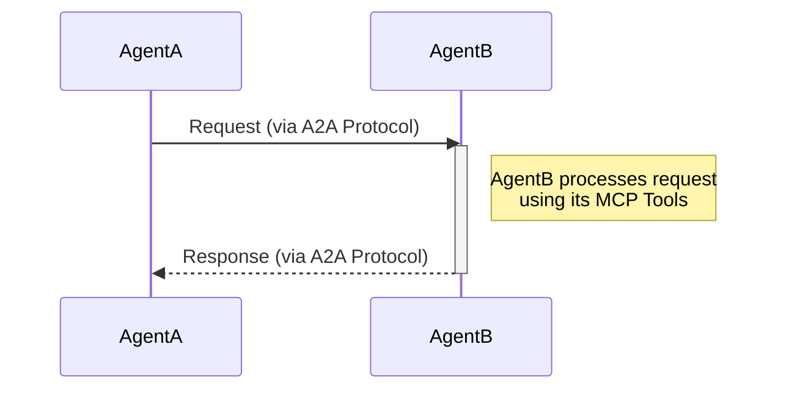

# Aarvi Workspace

This workspace contains three main projects:
- **Aarvi**: The ASP.NET Core A2A Server.
- **Services**: Service layer for kernel and MCP client integration used by A2A server.
- **Orchestrator**: Console orchestrator for agent chat that acts as an A2A client to connect to A2A server.

## Architecture: Agent-to-Agent (A2A) Protocol

## Prerequisites
- [.NET 8 SDK](https://dotnet.microsoft.com/en-us/download/dotnet/8.0)
- Google Gemini API Key
- YouTube API Key (for YouTube Music integration)

## Setup

### 1. Clone the Repositorygit clone <your-repo-url>
cd Aarvi
### 2. Configure Secrets

Both the Gemini and YouTube API keys are required. Use [User Secrets](https://learn.microsoft.com/en-us/aspnet/core/security/app-secrets) for local development.

#### Add Gemini Keydotnet user-secrets set GEMINI_KEY "<your-gemini-key>"
#### Add YouTube Keydotnet user-secrets set YOUTUBE_KEY "<your-youtube-key>"
You can also edit the secrets.json file directly if needed.

### 3. Build the Solutiondotnet build
### 4. Run the Projects

#### Run the Web API (Aarvi): dotnet run --project Aarvi
#### Run the Orchestrator Console: dotnet run --project Orchestrator
## Features
- Real-time chat with Gemini via Web API and console.
- YouTube Music integration (requires YouTube API key).
- Extensible agent and plugin system.

## Notes
- Ensure your API keys are valid and have the necessary permissions.
- For local development, user secrets are recommended to avoid committing keys to source control.

## Troubleshooting
- If you encounter missing key errors, verify your user secrets are set for the correct project.
- For YouTube integration, ensure your API key is enabled for the YouTube Data API v3.

---

For more details, see the code in each project directory.
